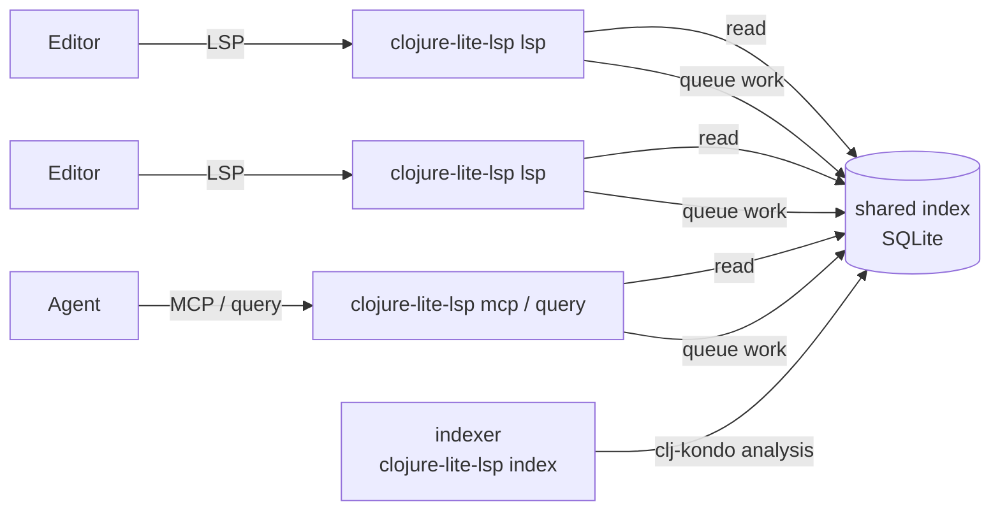

# How it works

## Two kinds of process

- **The language server** (`clojure-lite-lsp lsp`), one per editor, only reads.
  It answers from the index directly, with no analysis in memory, which is why
  it stays around 20 MB.
- **The indexer** (`clojure-lite-lsp index`), one per machine, is the only
  writer. The first server or query that needs it starts it; it works through
  a queue of requests in the index, and exits after ten idle minutes. Liveness
  is a file lock, so a crashed indexer is simply replaced.

They coordinate only through the SQLite index and file locks: no network ports.

## Content-addressed analysis

Every analyzed file (a source file, or an entry in a jar) is a *unit*, keyed by
what went into its analysis:

- its content
- its file type
- the clj-kondo version
- the clj-kondo configuration that can affect it

Projects don't own units; they link to them. So:

- **A library jar is analyzed once**, and every project using it links to the
  same units. Libraries are analyzed with only their own exported clj-kondo
  config, so the result doesn't depend on which project asked.
- **A new worktree** links to every unit it shares with other checkouts, and
  analyzes only files whose content is new.
- **A changed file** gets a new unit; the old one is garbage-collected once
  nothing links to it.

## Config changes, per macro

A branch's clj-kondo config often differs a little: a `:lint-as` entry, a hook.
Rather than re-analyze everything, clojure-lite-lsp compares configs per symbol:

- It works out what in a config can change analysis (`:lint-as`, hooks and
  their code, `:config-in-call`, `:config-in-ns`), per macro and per namespace.
- A file is re-analyzed only when something it uses changed.
- Settings that only affect linting never count: clojure-lite-lsp doesn't
  report lint findings.

## Hooks that ask about other namespaces

clj-kondo hooks can call `ns-analysis` to see another namespace's vars (to
generate re-exported definitions, for instance). clj-kondo answers that from its
cache, which clojure-lite-lsp doesn't use. clojure-lite-lsp answers it from the
index instead, records the answer with the file's analysis, and re-analyzes the
file when that answer changes.

## Editing

Editors send changes as you type. clojure-lite-lsp doesn't re-analyze unsaved
text: it maps positions between your buffer and the saved file line by line, so
answers stay right while you edit, and re-indexes the file when you save.

## Garbage collection

After a quiet spell the indexer drops what nothing uses: units no project links
to, jars no classpath has, projects not seen for 30 days. `clojure-lite-lsp gc`
runs it now.
