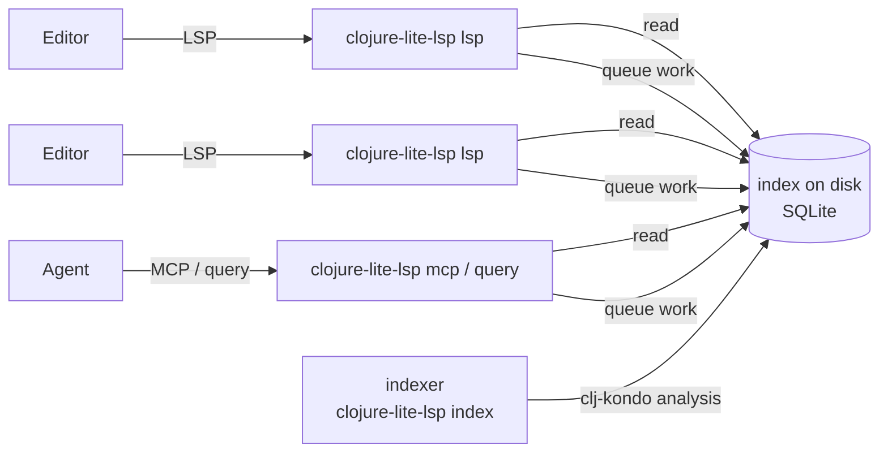

# Architecture

How clojure-lite-lsp is put together, and why it stays small.

## The index is on disk

Analysis isn't kept in memory. It lives in one SQLite database for the whole
machine (`~/.cache/clojure-lite-lsp/v<n>/index.db`), with tables laid out for
the questions the server answers: definitions by name, usages by what they
point to, the elements of each file by position.

Answering a request is a few indexed lookups, so a server doesn't need the
analysis in memory to be fast. Readers memory-map the database, so its pages
live in the operating system's file cache and are shared by every process
reading it, instead of each server holding its own copy.

## Two kinds of process

- **The language server** (`clojure-lite-lsp lsp`), one per editor, only
  reads. It's a native binary holding no analysis of its own, which is why it
  stays around 20 MB whatever the project's size. `query` and `mcp` answer the
  same way.
- **The indexer** (`clojure-lite-lsp index`), one per machine, is the only
  writer. The first server or query that needs it starts it. It works through
  a queue of requests kept in the index, and exits after ten idle minutes.

They coordinate only through the index and file locks: there are no network
ports. A lock held for the indexer's whole life says whether it's running, so
a crashed indexer is simply replaced by the next one needed.

## Analysis is shared, by content

Analysis comes from [clj-kondo](https://github.com/clj-kondo/clj-kondo). Every
analyzed file, whether a source file or an entry in a jar, is stored once,
keyed by what went into analyzing it:

- its content
- its file type
- the clj-kondo version
- the clj-kondo configuration that can affect it

Projects don't own analysis; they link to it. So:

- **A library jar is analyzed once**, and every project using it links to the
  same analysis. Libraries are analyzed with only their own exported clj-kondo
  config, so the result doesn't depend on which project asked.
- **A new worktree** links to everything it shares with checkouts already
  indexed, and analyzes only files whose content is new.
- **A changed file** gets new analysis. The old one is dropped once nothing
  links to it.

## Configuration changes, per macro

Branches often differ a little in their clj-kondo config: a `:lint-as` entry,
a hook. Rather than re-analyze every file, clojure-lite-lsp works out what in
a config can change analysis (`:lint-as`, hooks and their code,
`:config-in-call`, `:config-in-ns`), per macro and per namespace, and
re-analyzes only the files that use something that changed. Settings that only
affect linting don't count, since clojure-lite-lsp doesn't report lint
findings.

## Hooks that ask about other namespaces

A clj-kondo hook can call `ns-analysis` to see another namespace's vars, for
instance to generate re-exported definitions. clojure-lite-lsp answers that
from the index, records the answer with the file's analysis, and re-analyzes
the file when the answer changes.

## Unsaved edits

Editors send changes as you type. clojure-lite-lsp doesn't re-analyze unsaved
text: it maps positions between your buffer and the saved file line by line,
so answers stay right while you edit, and re-indexes the file when you save.

## Cleaning up

Shortly after the indexer goes idle, it drops what nothing uses: analysis no
project links to, jars no classpath has, and projects not seen for 30 days.
`clojure-lite-lsp gc` does it on demand.
